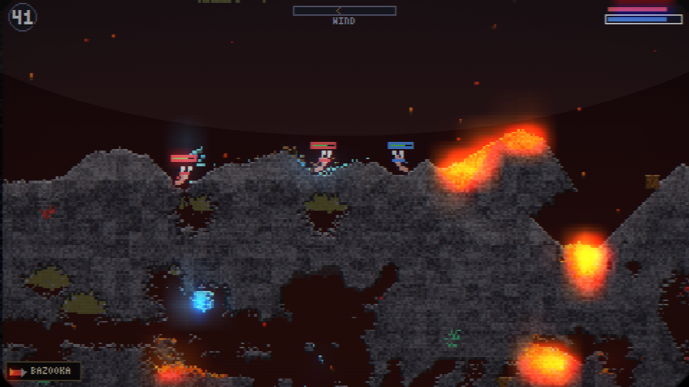
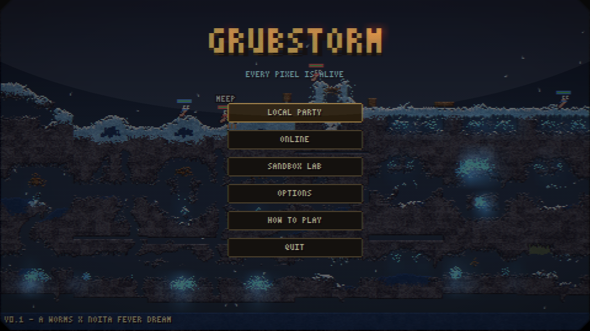
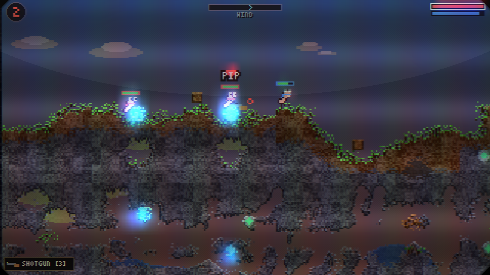
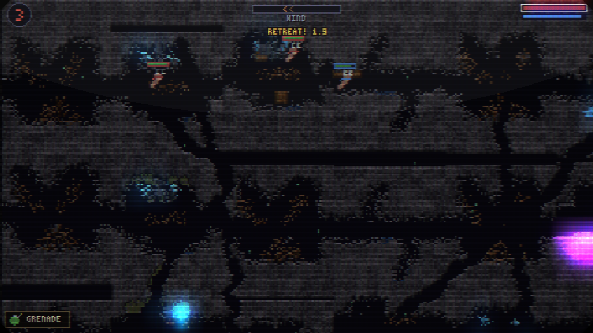
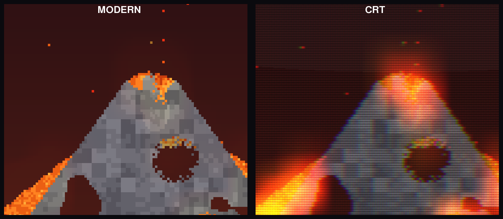

# GRUBSTORM

**Worms World Party, but the entire world is physically alive.**

A turn-based artillery party game fused with a Noita-style falling-sand
simulation. Every pixel of terrain is a simulated material: sand falls, water
flows, oil ignites, acid dissolves bunkers, gas pockets deflagrate, lava
quenches into stone, electricity hunts through water and metal — and your
rocket is just the first domino.



| | |
|---|---|
|  |  |
|  | every pixel is simulated |

## Quick start

One command, no clone, no setup (needs [uv](https://docs.astral.sh/uv/)):

```bash
uvx --from git+https://github.com/alexgalkin94/worms-mythos grubstorm
```

Working on the repo:

```bash
git clone https://github.com/alexgalkin94/worms-mythos && cd worms-mythos
uv run grubstorm
```

(`uv` creates the venv, installs pinned deps from `uv.lock`, builds and runs.
No uv? `pip install .` then `grubstorm` works too.)

Local hot-seat: **Local Party → add teams (humans or bots) → pick an arena →
START**. Pass the keyboard around.

### Play online with friends

Someone runs the relay (any cheap VPS or a LAN machine, pure stdlib):

```bash
uvx --from git+https://github.com/alexgalkin94/worms-mythos grubstorm-server
# or in the repo: uv run grubstorm-server      # listens on :31999
```

Everyone else: **Online → set the server address → Create Private Lobby** →
share the 4-letter room code. Friends join with the code, the host hits
start. 2–8 players plus bot teams.

The simulation runs in deterministic lockstep: only the active player's
inputs travel over the wire, every client computes the identical world.
If someone disconnects the host keeps the match alive for them; rejoining
with the same name hands them their team back via a full state snapshot.
(All players should run the same Python/numpy versions.)

## Controls

Modern scheme: aim with the mouse, fire with the mouse, move with the keys.
Jumping has coyote time and input buffering, short rough walls are scrambled
up automatically, and a worm buried by sand or debris digs itself out.

| Input | Action |
|---|---|
| A D / ← → | walk |
| mouse | aim (W/S or ↑↓ fine-tune; keys take over until the mouse moves) |
| left mouse (or F) | hold to charge, release to fire |
| left mouse | target for click-weapons (airstrike, teleport, lightning…) |
| SPACE / ENTER | jump (also releases the rope) · SHIFT/BACKSPACE backflip |
| Q / E | cycle weapons · TAB / right-click full arsenal |
| mouse wheel | zoom · middle-drag / screen edges pan · HOME re-follow |
| SPACE (between turns) | fast-forward the settling world |
| ESC | pause (Options live here too) |

## The world

29 simulated materials with density, viscosity, flammability, corrosion,
conductivity, hardness, melting/freezing and light emission. Reactions are
the gameplay:

- water + lava → steam + obsidian
- fire spreads through wood, grass, oil, napalm and gas
- acid eats terrain (slowly chews metal) and exhales toxic puffs
- explosive powder and nitro chain-react — one spark, whole vein
- freeze ray turns lakes into walkable bridges; heat melts them back
- electricity conducts through water and metal and *hurts*
- toxic sludge poisons, magic goo does... something, every time
- black holes eat terrain, liquids, grubs, projectiles and your friendships

**35 weapons & tools** across classic boom (bazooka, grenade, cluster,
shotgun, mine, dynamite, airstrike, homing, Holy Melon), chemistry (acid /
oil / sludge / slime flasks, lava bomb, gas canister, powder bomb, steam
bomb, crystal bomb, napalm strike), energy (water cannon, freeze ray, spark
gun, lightning rod, transmuter, liquefier, black hole, gravity flip) and
movement (ninja rope, jetpack, parachute, teleport, girder, blowtorch,
drill).

**11 arenas**, procedurally generated per match: Grubtide Isle, Mt. Kaboom,
The Drips (acid sewer), Frostbite Flats, Dune & Doom, Gloomhollow (dark
crystal cave), Scrapheap, Powderkeg Mine, Lab 13, Goopland, Lunar Lounge
(low gravity). Plus any map you build in the sandbox.

**Rigid props** — wooden crates and planks, stone blocks, metal beams —
live *inside* the sand sim: liquids pool against them, worms stand on
them, fire eats them, explosions shove them around, and when they break
they shatter into loose material.

**Match rules:** turn timer, wind, fall damage, drowning, poison, crates
(weapon / health / booby-trapped), retreat time, sudden death floods the map
with the biome's signature fluid. Mutators: low gravity, one-shot kills,
random weapons, crate madness, all-super-weapons. After the match: a full
stats screen (damage, kills, biggest hit, accuracy) with an In Memoriam
for the fallen.

**Bots** in four flavors — Chaotic Dummy, Regular Joe, Tactician, Evil
Genius — with real ballistic solving and personality-driven bad decisions.
Worms heckle each other in little speech bubbles when the shells land.

**Sandbox Lab:** paint any material, set things on fire, trigger explosions,
and save experiments as playable maps (`O` key → appears in match setup).

## Performance

The simulation runs at a fixed deterministic 60 Hz; rendering is decoupled
and runs as fast as your FPS cap allows (60 / 120 / 144 / 240 / uncapped in
Options, default 144, with an FPS counter toggle). To make that possible:

- the sim only processes an **active region** around things that are
  actually moving, burning, corroding or reacting
- fluids and gases **go to rest**: pools stop sloshing once settled and the
  whole map drops to near-zero cost — explosions, heat, digging and fresh
  flow wake them back up
- the renderer caches composed cells/lighting and repaints only the dirty
  rectangle on sim ticks; render-only frames just re-blit
- the CRT pipeline is collapsed into one upscale, one multiply overlay
  (mask + scanlines + vignette) and a low-res bloom pass

On a modest CPU this lands at 160–240 fps in normal play and ~100+ fps in
the middle of continuous multi-explosion chaos (sim frames briefly go
slow-mo rather than stutter if the machine can't keep up). A smaller
window size (Options → Window size) buys more headroom on weak machines.

## Presentation

Everything renders into a 480×270 cell grid and goes through a CRT pipeline
modeled on how real tubes actually display pixel art — the pixels melt:



- the beam smears neighbouring pixels into continuous color (horizontal
  bilinear pass); the phosphor slot mask provides the fine structure the
  pixel grid used to
- mask + scanlines + vignette are one gamma-correct multiply, so dark lines
  don't crush brightness
- halation: bright light scatters in the glass and fills scanline gaps
  around hot pixels
- phosphor persistence leaves faint trails on fast bright things, plus
  deconvergence fringe, glass shine, gentle flicker, and opt-in true barrel
  curvature
- emissive materials (lava, fire, acid, crystals, magic) light up dark
  caves, and bright pixels bloom

Every tube parameter is its own slider (beam smear, scanlines, slot mask,
color fringe, halation, phosphor trail, flicker, vignette, curvature,
bloom) with presets — Clean, Subtle, Arcade, Trinitron, Haunted — and the
options screen is reachable from the pause menu, previewing your live
match while you tune. Plus a reduced-flashing mode and colorblind-friendly
team palettes.

## Music

The soundtrack is performed at runtime from hand-transcribed classical
scores — Satie's Gymnopédie and Gnossienne, Pachelbel's Canon,
Greensleeves, Chopin's Op. 28 No. 4 — with per-launch variations
(transposition, block / rolled / broken accompaniment, grace notes,
humanized timing) played on real sampled instruments: electric piano,
strings, harp, flute, celesta and choir via
[tinysoundfont](https://pypi.org/project/tinysoundfont/) and the bundled
[GeneralUser GS](https://github.com/mrbumpy409/GeneralUser-GS) SoundFont
(license included). A seamless loop reverb (circular FFT convolution) makes
the final bar's tail bloom into the first. Menus get the main theme; each
arena gets a mood (warm / cold / dark / deep) that crossfades in. If the
SoundFont stack is unavailable, a hand-built numpy synth fallback (detuned
pads, Karplus-Strong strings, FM bells) takes over. Music and SFX have
separate volume sliders.

## Repository layout

```
grubstorm/
  world.py      vectorized falling-sand sim (numpy, active-region culled)
  materials.py  the material property tables — add a material here
  mapgen.py     procedural biomes
  chunks.py     hand-authored chunk templates the biomes are stitched from
  game.py       turn engine, damage, crates, sudden death, snapshots
  weapons.py    the arsenal (projectiles, streams, black holes)
  grub.py       characters: walking, roping, jetpacking, drowning
  bodies.py     rigid props living inside the sand sim
  ai.py         deterministic bots
  render.py     cell compositor, camera, lighting, HUD
  icons.py      procedural weapon icon art
  crt.py        the glass
  music.py      runtime performances of classical scores
  net.py        lockstep client
  ui.py/app.py  menus, screens, the cabinet
  sandbox.py    the lab
  relay.py      room-code relay server (stdlib only, `grubstorm-server`)
```

Determinism contract: anything that affects game state must draw randomness
from `game.rng` / `world.rng` and never from wall-clock time. Render and
audio may do whatever they like.
